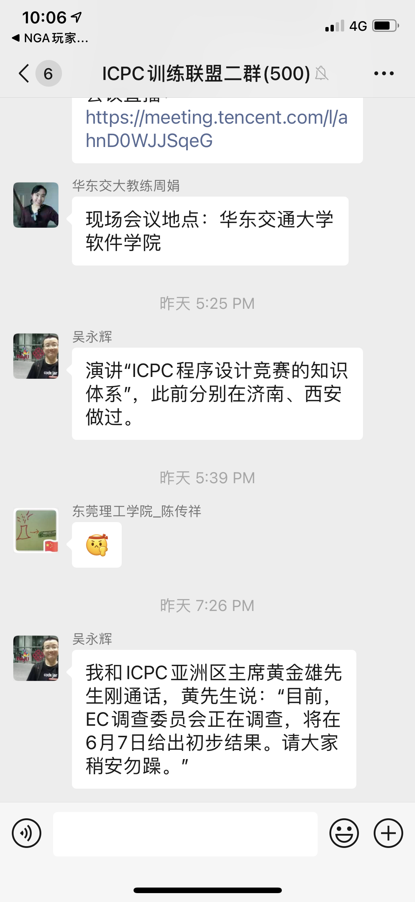
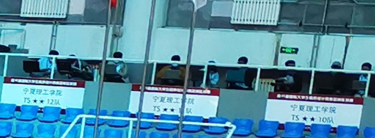
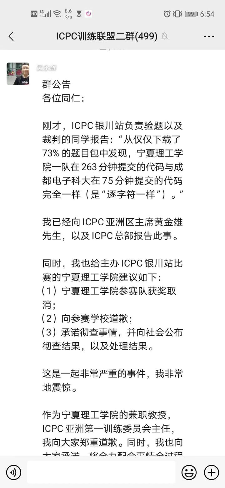
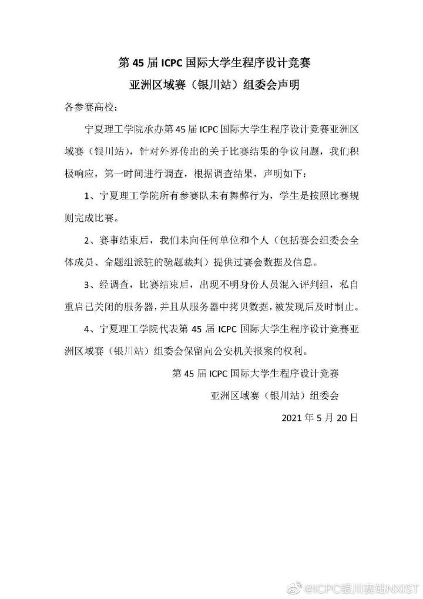

# Awesome(😅) IUPC 2021(ICPC Yinchuan Regional 2021)

**New update: The history of ICPC corruption in China: [如何看待 2021 年的 ICPC 银川站涉舞弊争议，宁夏理工学院在官方公众号发布优秀队员获金牌感言？- 邬晓钧的回答](https://www.zhihu.com/question/461222006/answer/1904881160)**

**Under construction**
<!-- [中文](README_zh.md) -->

## TL;DR

In ICPC Yinchuan Regional 2021, two teams from NXIST (Ningxia Institute of Science and Technology, the organizer of this contest) were caught conducting cheating with strong evidence (copy-pasting code of other teams, using three computers). They were awarded a gold medal and a silver medal. And they left unpunished till now. The organizer denies this obvious cheating action, accused the judge who reveals this fact as an "unidentified person" illegally copied the result from the server, refused to take further action.

## About this repo

Our objective is to make all ICPC contestants and people interested in competitive programming aware of this mindblowing cheating event in ICPC. A lot of work still needs to be done, including adding details, correcting spell/grammar errors, adding a concise description (TL;DR), adding a Chinese version, **pull requests are extremely needed and highly appreciated**!

IUPC is an ironic alias of ICPC Yinchuan Regional hold by NXIST. It's originated from a poster of NXIST which used an incorrect English translation "International University Programming Contest" to refer to ICPC, reflecting NXIST has no respect for ICPC.

## Links

### Overview

[Overview of this event on codeforces.com: Corruption, Cheating at ICPC Yinchuan](https://codeforces.com/blog/entry/90897)

### Discussion

[Results given by anti-plagiarism tools (Chinese)](https://zhuanlan.zhihu.com/p/373983806)

[Discussion on zhihu.com (Chinese): 如何看待 2021 年 ICPC 银川赛区主办方宁夏理工学院获得一金一银？](https://www.zhihu.com/question/459857672)

[Discussion on zhihu.com (Chinese): 组委会回应 2021 年 ICPC 银川站争议，称宁夏理工学院没有舞弊行为，还有哪些信息值得关注？](https://www.zhihu.com/question/460422916)

[Discussion on zhihu.com (Chinese): 如何评价ICPC银川站在铁证如山的情况下微博发布的作弊调查结果？三机位三个笔记本，是否违规？](https://www.zhihu.com/question/460542016)

[Discussion on zhihu.com (Chinese): 如何评价 2021 年 ICPC 银川赛区？](https://www.zhihu.com/question/436832940)

[Article on zhihu.com (Chinese): 宁理事件之我见](https://zhuanlan.zhihu.com/p/374973215)

[Article on zhihu.com (Chinese): 关于银川赛区的一点随想](https://zhuanlan.zhihu.com/p/375277640)

[Article on zhihu.com (Chinese): 如何看待 2021 年的 ICPC 银川站涉舞弊争议，宁夏理工学院在官方公众号发布优秀队员获金牌感言？- 邬晓钧的回答](https://www.zhihu.com/question/461222006/answer/1904881160)

[Article on zhihu.com (Chinese): 随笔（2021.5.26）](https://zhuanlan.zhihu.com/p/375467800)

### Response of NXIST

[Weibo response (Chinese)](https://weibo.com/u/7535856183)

[Wechat news article (Chinese)](https://mp.weixin.qq.com/s?__biz=MzI2NzU5NTU3NQ==&mid=2247504526&idx=1&sn=860e28dc1121c23b76401b96de88758c&chksm=eafee8d6dd8961c0489d92af846d9289390ca013f617314dc84d5e99f928025e2d37d34ffc74&mpshare=1&scene=23&srcid=05245815p8kQp0wQBEz8UmrH&sharer_sharetime=1621864239839&sharer_shareid=b375808bc096414bf1f7ae3e849e2bc1#rd)

### Other

[T-shirts in memory of this event (Chinese)](https://zhuanlan.zhihu.com/p/374928451)

[QQ group for discussion of this event: AUPC-2021🐸老师🐬老师和🐯老师粉丝群](https://jq.qq.com/?_wv=1027&k=XNO85Yd4)

## Gallery

### The director said the investigation result will be released on June 7th

### Evidence of using three computers

### Comfirmation of plagiarism

### Response of organizer

